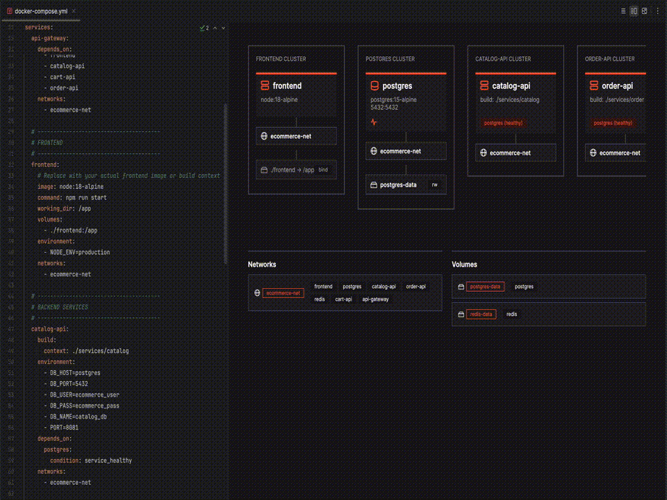
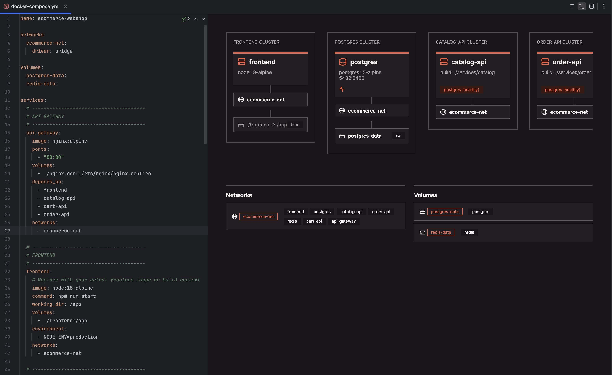
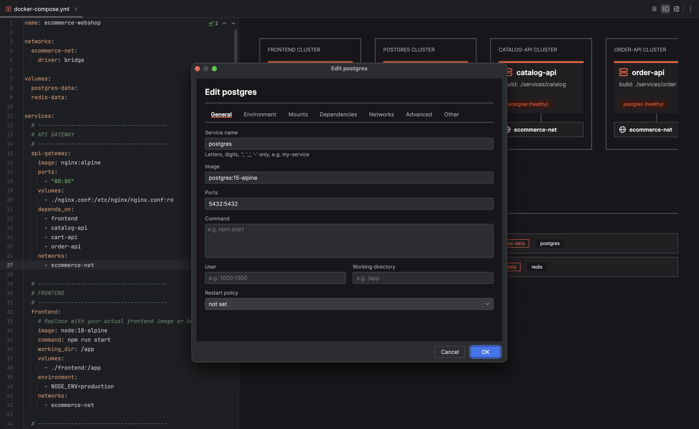
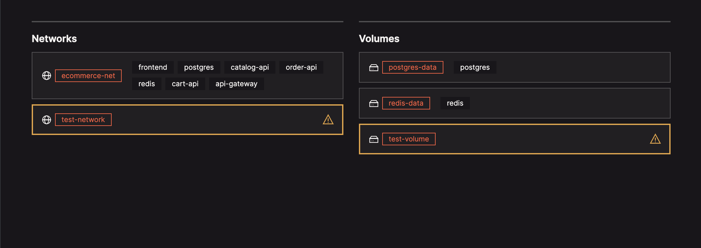

  <picture>
    <source media="(prefers-color-scheme: dark)" srcset="docs/logo-dark.svg">
    
  </picture>

# Docker Compose Visualizer

Docker Compose Visualizer turns a `docker-compose.yml` into a live diagram: one card per service, ordered by `depends_on`, with networks, volumes, configs, and secrets summarized below. Problems such as broken or circular dependencies and port conflicts are flagged on the card as you type. Viewing is free. Editing from the diagram requires a license.

**Free to view, license required to edit.** The Architecture canvas, the validation warnings, and the Effective Config view are free. Editing from the diagram requires a license.

**Recognized files:** `compose.yaml`, `compose.yml`, `docker-compose.yml`, `docker-compose.yaml`, and override files such as `compose.override.yaml`. Any other name is recognized when a `COMPOSE_FILE` in a `.env` file above it lists it.

**Documentation:** See the [Documentation page](https://github.com/devgrs1005/docker-compose-visualizer/wiki/Documentation) for how to read the diagram, what each warning means, and how Effective Config works.

## Free to view

- **See your stack at a glance:** Services are ordered by dependency, not declaration order, and each card shows healthcheck, restart-policy, and mount status.
- **Find unused resources:** Every network, volume, config, and secret is listed in one place, and any that no service uses is flagged.
- **Catch problems early:** Broken or circular `depends_on`, two services publishing the same host port, and malformed fields are flagged on the card. Unrecognized `restart:` policies and `service_healthy` dependencies on a service without a healthcheck are flagged too.
- **See what Docker actually runs:** Effective Config shows the merged result of your base file, override files, `include:` files, and selected profiles, resolved by `docker compose config`. Each service and resource shows the file that defines it.
- **Read less common fields:** Long-form ports, per-network IP and alias settings, and more are shown, not only the common shorthand.

## Requires a license to edit

- **Edit services in a form:** The edit dialog covers image, environment, mounts, dependencies, and networks.
- **Keep comments and formatting:** Changes go back into your existing YAML file, and comments and formatting are preserved.
- **Edit the merged result:** In Effective Config, a change is written to the file that defines the value: the base, an override, or an included file.
- **Add and remove resources:** Add, attach, detach, and delete services, networks, volumes, configs, and secrets from the canvas.
- **Create a new file:** Scaffold a new Compose file from File > New.
- **Edit any field:** A fallback editor reaches the fields the edit dialog does not cover.
- **Delete safely:** The plugin asks for confirmation before deleting anything still in use and shows how many services reference it. Duplicate service names, invalid characters, and missing required fields are blocked before an edit is saved.

## Screenshots

**Architecture canvas:** A multi-service stack with cards in dependency order, tags, and the resource summary underneath.

**Edit dialog:** The tabbed form open on a service, showing the Environment or Mounts tab.

**Resource summary:** The networks, volumes, configs, and secrets row with an unused-resource warning.

## Requirements

- IntelliJ IDEA 2025.2 (build 252) or newer, Community or Ultimate.
- The Docker plugin is not needed. The Docker CLI is needed only for Effective Config.

## Contributing

A sample compose file covering most supported fields is at
`samples/docker-compose.yml`. Open it in the sandbox IDE from `./gradlew runIde` to
try things out. See `AGENTS.md` for contributor conventions and the project's
architecture.

## License

Use of the plugin is governed by its [End User License Agreement](https://github.com/devgrs1005/docker-compose-visualizer/wiki/EULA).
