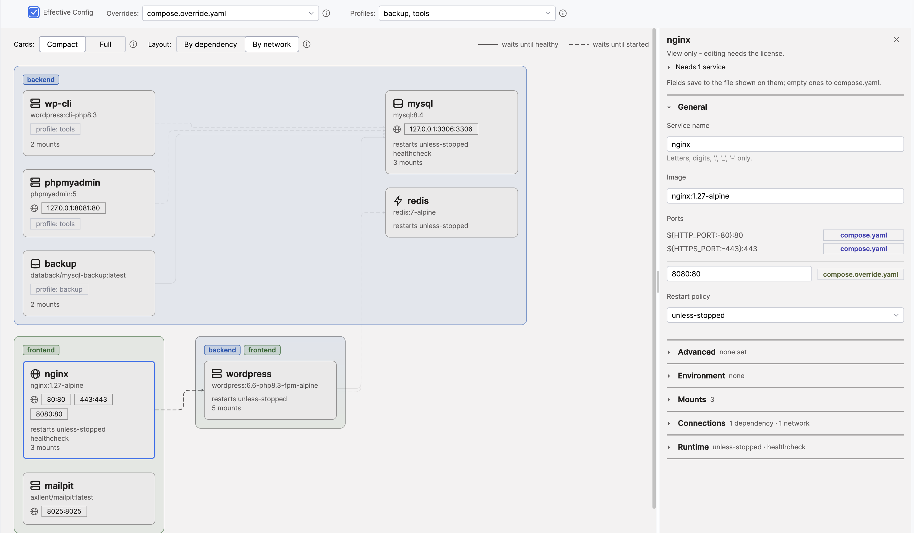
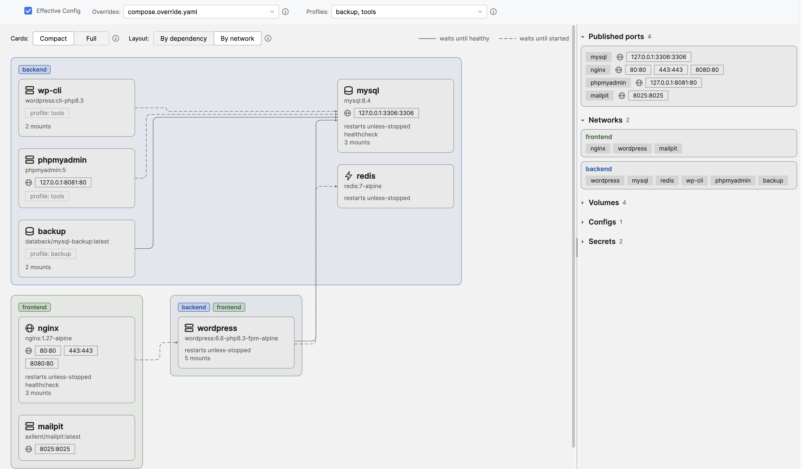
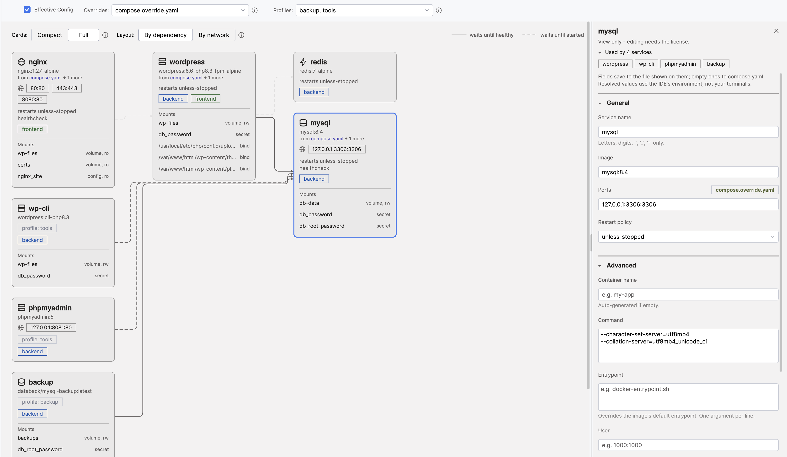
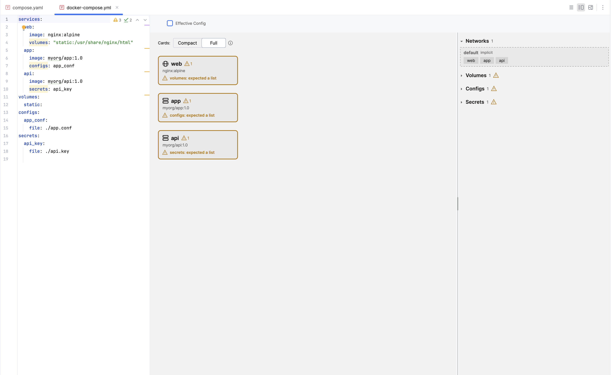

  <picture>
    <source media="(prefers-color-scheme: dark)" srcset="docs/logo-dark.svg">
    
  </picture>

# Docker Compose Visualizer

See how your Docker Compose setup fits together at a glance. Open a Compose file and Docker Compose Visualizer draws it as a diagram: every service is a card, arranged by what depends on what, or boxed together with the services that share its networks.

**Free vs. licensed:** Viewing, warnings and the combined view are free. With a license you can also make changes right from the diagram, and your file's comments and layout stay exactly as you wrote them.

**Recognized files:** `compose.yaml`, `compose.yml`, `docker-compose.yml`, `docker-compose.yaml`, and override files such as `compose.override.yaml`. Any other name is recognized when a `COMPOSE_FILE` in a `.env` file above it lists it.

**Documentation:** See the [Documentation page](https://github.com/devgrs1005/docker-compose-visualizer/wiki/Documentation) for how to read the diagram, what each warning means, and how Effective Config works.

## Free features

- **See your stack at a glance:** Choose Compact cards for the essentials or Full cards for every port, mount and warning. Ports published to your machine are marked on the card.
- **Look closer in a side panel:** Select a service to see all its settings next to the diagram.
- **Spot problems as you type:** A service waiting for something that does not exist, a circular dependency, two services using the same port, or a setting with an invalid value is flagged on the card and underlined in your file. You can switch the underlines off in Settings > Editor > Inspections.
- **Find what is not used:** Networks, volumes, configs and secrets that no service uses are listed and flagged.
- **Make sense of several files:** Switch to the combined view (Effective Config) to see your base file, override files, included files and chosen profiles put together, as Docker sees them. Each setting says which file it comes from; the label is left out when it is the file you have open.

## Licensed features

- **Edit in the side panel:** Change a service's settings in a panel next to the diagram, then Save or Revert. You can resize or collapse it, and add settings the file does not have yet with "Add property".
- **One-click fixes:** Press Alt+Enter on an underlined problem in your file to fix common ones, such as a missing dependency, an invalid restart policy, or a wait for a healthy service that has no healthcheck.
- **Your file stays yours:** Changes go back into your existing file, and comments and layout are kept.
- **Edit the combined view:** A change is saved to the file that sets the value, whether that is the base, an override or an included file.
- **Add, connect and delete:** Add, attach, detach and delete services, networks, volumes, configs and secrets from the diagram, or create a new Compose file from File > New.
- **Safer rename and delete:** In the combined view, renaming or deleting a service updates every place that refers to it, after asking you to confirm what will change. With a single file open, you are warned if another Compose file still uses it. A service that others inherit settings from cannot be deleted. Duplicate names, invalid characters and missing required fields are caught before you save.

## Screenshots

**Boxed by network:** Services that share networks sit together, with a card per service. Select one to see its settings and which file each value comes from in the side panel.

**Overview:** With nothing selected, the side panel lists published ports, networks, volumes, configs and secrets.

**By dependency:** Columns follow what waits for what; solid arrows wait until healthy, dashed ones until started.

**Warnings in your file:** Problems are underlined in the YAML and flagged on the matching card.

## Requirements

- IntelliJ IDEA 2025.2 (build 252) or newer, Community or Ultimate.
- The Docker plugin is not needed. The Docker CLI is needed only for Effective Config.

## Contributing

A sample compose file covering most supported fields is at
`samples/docker-compose.yml`. Open it in the sandbox IDE from `./gradlew runIde` to
try things out. See `AGENTS.md` for contributor conventions and the project's
architecture.

## License

Use of the plugin is governed by its [End User License Agreement](https://github.com/devgrs1005/docker-compose-visualizer/wiki/EULA).
